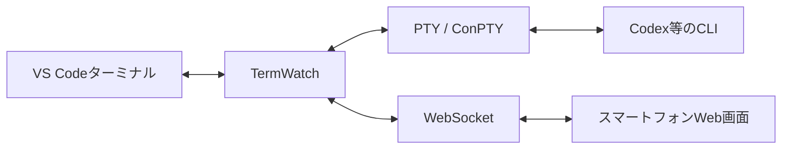

# TermWatch 要件定義書 v1.0

- 文書ステータス: MVP仕様確定
- 作成日: 2026-08-09
- 対象OS: Windows 11（主対象）、Windows 10 22H2（可能な範囲で対応）
- 主な利用環境: VS Code統合ターミナル、iPhoneのSafari／Chrome

## 1. 製品概要

TermWatchは、Windows PCのVS Code統合ターミナルで動かすコーディングエージェントを、スマートフォンのWebブラウザからリアルタイムに監視・操作するための個人利用向けツールである。

通常はスマートフォン側を閲覧専用とし、必要なときだけ一定時間「操作モード」を有効にする。PC画面全体の共有、ファイル操作、クラウドへのログ保存は行わない。

### 1.1 解決する課題

- PCから離れている間も、コーディングエージェントの進捗を確認したい。
- エージェントが質問、承認、追加指示待ちになったとき、スマートフォンから回答したい。
- リモートデスクトップのようにPC画面全体へアクセスする必要はない。
- ターミナル内容やソースコードを一般のインターネットへ公開したくない。

### 1.2 基本利用イメージ

```powershell
termwatch -- codex
```

既存のCodexセッションを再開する場合:

```powershell
termwatch -- codex resume --last
```

その他のCLIエージェントを使う場合:

```powershell
termwatch -- claude
termwatch -- gemini
```

## 2. 設計方針

1. PC側のVS Codeターミナルを主操作端末とする。
2. TermWatchはコーディングエージェントを擬似端末（PTY）内で子プロセスとして起動する。
3. 子プロセスの出力を、PC側ターミナルとスマートフォン側Web画面へ同時配信する。
4. PC側の入力は常時受け付ける。
5. スマートフォン側は既定で閲覧専用とし、明示操作時だけ入力を許可する。
6. リモート通信はVS Code組み込みのPort Forwarding（Microsoft dev tunnels）を利用し、追加ソフトのインストール、ルーターのポート開放、一般公開を要求しない。
7. ターミナル出力は既定でディスクへ保存しない。
8. インストール不要のポータブル配布を目標とする。

## 3. システム構成



### 3.1 PC側

- CLIラッパー
- PTYプロセス管理
- ローカル入出力の転送
- Webサーバー
- WebSocketサーバー
- セッション認証
- 出力リングバッファ
- VS Code Port Forwarding利用案内

### 3.2 スマートフォン側

- インストール不要のWeb UI
- xterm.jsによるターミナル表示
- 複数行メッセージ入力欄
- 特殊キー操作パネル
- 接続状態・操作権状態表示

## 4. MVPの対象範囲

### 4.1 MVPに含める機能

- 任意のCLIコマンドの起動
- PCとスマートフォンへのリアルタイム出力
- ANSIカラー、カーソル移動、日本語の表示
- スマートフォンからの複数行指示送信
- Enter、Esc、Tab、Ctrl+C、方向キー、y、nの送信
- 閲覧専用モードと操作モードの切り替え
- 操作権の自動失効
- VS Codeの非公開転送URLとワンタイムペアリングコードによる接続
- GitHubまたはMicrosoftアカウントで保護された非公開ポート転送
- 切断後の再接続
- 直近出力の再表示
- 子プロセスの終了コード表示
- 1台のスマートフォンによる操作権取得
- 複数ブラウザからの閲覧
- ポータブル配布

### 4.2 MVPに含めない機能

- すでに起動済みのVS Codeターミナルへの後付け接続
- PC画面の共有・遠隔操作
- ファイルブラウザー、エディター、Git差分表示
- クラウド経由の独自中継サービス
- ターミナルログのクラウド保存
- PCの遠隔起動、スリープ解除
- 複数ユーザーによる共同操作
- プロンプト内容を解析した「承認待ち」などの意味判定
- iOSプッシュ通知
- Android専用アプリ、iOS専用アプリ
- 公開インターネットからの直接接続

## 5. CLI仕様

### 5.1 基本構文

```text
termwatch [TermWatchオプション] -- <実行コマンド> [引数...]
```

`--`より後ろの内容は、原則として改変せず子プロセスへ渡す。

### 5.2 MVPオプション

| オプション | 既定値 | 内容 |
|---|---:|---|
| `--cwd <path>` | 現在のフォルダー | 子プロセスの作業フォルダー |
| `--port <number>` | `43821` | ローカルWebサーバーのポート |
| `--buffer-lines <number>` | `10000` | 再接続用に保持する最大表示行数 |
| `--control-minutes <number>` | `10` | スマートフォン操作権の有効時間 |
| `--record <path>` | 無効 | 明示指定時のみ生ログを保存 |
| `--local-only` | 無効 | スマートフォン接続を無効化 |
| `--help` | - | ヘルプ表示 |
| `--version` | - | バージョン表示 |

### 5.3 終了動作

- 子プロセスの終了コードをTermWatch自身の終了コードとして返す。
- Ctrl+Cは、操作元にかかわらず原則として子プロセスへ送る。
- 子プロセス終了後、Web画面へ終了コードを通知する。
- 終了通知を送るため最大3秒の猶予を置いた後、TermWatchを終了する。
- 異常終了時もローカル端末のraw mode、カーソル、入力状態を必ず復元する。

## 6. PTY・ターミナル仕様

### 6.1 子プロセス起動

- Windows ConPTYに対応したPTYライブラリを使用する。
- 標準のパイプ処理ではなくPTYを使用し、Codex等のフルスクリーンTUIを扱えるようにする。
- ローカルの標準入力をPTYへ転送する。
- PTY出力をローカル標準出力とWebSocketへ同時転送する。

### 6.2 画面サイズ

- PC側VS Codeターミナルの列数・行数を正とする。
- PC側ターミナルのサイズ変更をPTYへ反映する。
- スマートフォン側からPTYの列数・行数を変更しない。
- スマートフォン側は縮小表示、折り返し、横スクロールで対応する。
- これにより、スマートフォン接続時にPC側表示が崩れることを防ぐ。

### 6.3 出力バッファ

- メモリ上に直近10,000表示行を保持する。
- 新規接続・再接続時に保持内容を送信した後、ライブ出力へ切り替える。
- 上限を超えた古い内容は先頭から破棄する。
- 既定ではディスクに保存しない。
- `--record`指定時のみ、受信した生PTYデータを指定先へ保存する。

## 7. スマートフォンWeb UI仕様

### 7.1 画面構成

#### ヘッダー

- セッション名または実行コマンド
- 接続状態
- プロセス状態
- 最終出力からの経過時間
- 操作モードの残り時間
- 操作端末の有無

#### ターミナル表示部

- xterm.jsを使用する。
- ANSIカラーとカーソル制御を反映する。
- 日本語を正常に表示する。
- 新規出力時は、利用者が最下部付近にいる場合のみ自動スクロールする。
- 過去ログ閲覧中は勝手に最下部へ戻さない。
- 「最新位置へ」ボタンを表示する。

#### 入力部

- 既定では折りたたみ、または無効表示とする。
- 操作モード時のみ入力可能とする。
- 複数行テキストエリアを使用する。
- 「送信」ボタンで内容を一括送信し、最後にEnterを送る。
- 複数行テキストは可能な場合にbracketed pasteとして送信し、途中送信を防ぐ。
- 送信後は入力欄を空にする。
- 送信履歴を現在のブラウザセッション内だけに保持する。

#### 特殊キーバー

- `Enter`
- `Esc`
- `Tab`
- `Ctrl+C`
- `↑`
- `↓`
- `←`
- `→`
- `y`
- `n`

`Ctrl+C`は赤色系の危険操作として表示し、タップ後に確認を要求する。

### 7.2 レスポンシブ対応

- iPhone縦向きを第一対象とする。
- 画面幅320px以上で主要操作が可能であること。
- 入力欄表示時もターミナルの現在行が確認できること。
- iOSのソフトウェアキーボード表示によるレイアウト崩れを抑えること。
- ダークテーマを既定とする。

## 8. 接続・認証仕様

### 8.1 ネットワーク境界

- Webサーバーは`127.0.0.1:<port>`だけで待ち受ける。
- `0.0.0.0`、LAN IP、パブリックIPでは待ち受けない。
- VS Code組み込みのPort Forwardingを利用し、Microsoft dev tunnels経由のHTTPS URLから中継する。
- 転送ポートの可視性は必ず`Private`とし、`Public`へ変更しない。
- 転送URLへのアクセスには、PC側で転送を開始したものと同じGitHubまたはMicrosoftアカウントの認証を要求する。
- ルーターのポート開放は行わない。
- Windowsファイアウォールの受信許可ルール追加を要求しない。
- dev tunnelsが組織ポリシーやネットワークで利用できない場合、リモート機能を自動的にLAN公開へ切り替えない。

### 8.2 初回セットアップ

1. VS CodeでTermWatchを起動し、`127.0.0.1:43821`で待ち受けていることを確認する。
2. VS Codeでコマンドパレットから`Ports: Focus on Ports View`を実行する。
3. Portsビューの`Forward a Port`でポート`43821`を転送する。
4. Port Visibilityが`Private`であることを確認し、`Public`へ変更しない。
5. 表示されたForwarded Addressをスマートフォンで開く。
6. PC側と同じGitHubまたはMicrosoftアカウントで認証する。
7. PC側ターミナルに表示されたワンタイムペアリングコードをスマートフォンへ入力する。

TermWatchはdev tunnelの作成・削除・公開範囲変更を自動実行しない。VS CodeのPortsビューを利用者が操作する。

### 8.3 セッション認証

- TermWatch起動ごとに、暗号学的乱数による256bit以上の内部セッショントークンと、手入力可能なワンタイムペアリングコードを生成する。
- ペアリングコードはPC側ターミナルだけに表示し、起動後10分または最初の認証成功時の早い方で失効させる。
- ペアリングコードは十分なエントロピーを持たせ、入力しやすさを保ちながら総当たりを防ぐ。形式とエントロピーは実装時に明記する。
- スマートフォンは非公開転送URLを開き、ペアリングコードを入力する。
- 認証成功後、サーバーは当該Webクライアントへランダムな内部セッショントークンを関連付ける。
- 認証完了前の出力取得・入力送信を禁止する。
- トークンはTermWatch終了時に無効化する。
- 無効な認証を連続して受けた場合は、一時的に接続受付を制限する。
- ペアリングコードとトークンをURL、通常ログ、アクセスログへ含めない。

### 8.4 Origin確認

- WebSocket接続時にOriginを確認する。
- HTTPのHostとWebSocketのOriginが同一オリジンであることを検証する。
- localhostまたはVS Codeの非公開転送ページと同一オリジンの接続だけを許可する。
- クロスサイトからのWebSocket接続を許可しない。

## 9. 閲覧モード・操作モード

### 9.1 閲覧モード

- スマートフォン接続時の既定モードとする。
- 出力閲覧、スクロール、コピーだけを許可する。
- PTYへの入力データは一切送れない。

### 9.2 操作モード

- スマートフォン上で「操作を有効にする」を選択する。
- 誤操作防止の確認画面を表示する。
- 確認後、当該クライアントへ10分間の操作権を付与する。
- 有効時間は画面上に常時表示する。
- 残り1分で警告する。
- 期限到達時に自動で閲覧モードへ戻す。
- 利用者が手動で即時解除できる。
- 切断が60秒以上継続した場合、操作権を自動解除する。

### 9.3 操作権の排他制御

- 同時に操作権を持てるスマートフォンは1台だけとする。
- 他の接続端末は閲覧専用とする。
- PC側のキーボード入力は常に優先し、スマートフォンの操作権があっても無効化しない。
- PC入力とスマートフォン入力が同時に届いた場合、受信順にPTYへ書き込む。
- PC側ターミナルに、スマートフォンが操作モード中であることを表示する。ただし子プロセスのTUIを壊さない方法で通知する。

## 10. 状態表示

MVPでは、端末出力を意味解析して「承認待ち」「質問待ち」と判定しない。誤判定を避けるため、観測可能な状態だけを表示する。

| 状態 | 判定基準 |
|---|---|
| 起動中 | 子プロセス生成前 |
| 実行中 | 子プロセスが生存中 |
| 出力停止中 | 子プロセスは生存しているが一定時間出力がない |
| 終了 | 子プロセスが終了済み |
| 再接続中 | WebSocket再接続処理中 |
| PC未接続 | WebSocketサーバーへ到達できない |

「出力停止中」は「入力待ち」を意味するとは表示しない。最終出力からの経過時間を併記する。

## 11. エラー処理

- 実行コマンドが見つからない場合、明確なエラーと終了コードを返す。
- 指定作業フォルダーが存在しない場合、子プロセスを起動しない。
- ポート使用中の場合、別ポートへ勝手に変更せず、使用中であることを表示する。
- VS Code Port Forwardingが未設定・利用不能でもローカル実行は継続し、Portsビューでの手動設定手順を表示する。
- WebSocket切断時も子プロセスを終了しない。
- スマートフォンから不正な制御データを受けても子プロセスやTermWatchをクラッシュさせない。
- PTY出力が高速な場合、ローカル操作を妨げないようWeb配信へバックプレッシャー制御を設ける。
- ブラウザ側が遅延した場合、古い未送信データを無制限に蓄積しない。

## 12. セキュリティ・プライバシー要件

- VS Codeの認証付きPrivate Port ForwardingをMVP唯一のリモート接続方式とする。
- TermWatch自身は公開用URLや独自クラウド中継を生成しない。
- 転送ポートをPublicへ変更する操作を案内・自動実行しない。
- GitHubまたはMicrosoftアカウントによるdev tunnel認証に加えて、TermWatch独自のワンタイムペアリング認証も要求する。
- セッショントークンをコンソールログ、アクセスログ、ディスクログへ保存しない。
- 操作入力をアプリ独自ログへ保存しない。
- ターミナル出力のディスク保存はオプトインとする。
- Web UIに任意のHTMLを挿入せず、ターミナル文字列はxterm.jsへデータとして渡す。
- WebSocketメッセージの種類、サイズ、頻度を検証する。
- 1回のテキスト送信上限を64KiBとする。
- クリップボードへの自動コピーを行わない。
- PC側終了時に接続、トークン、メモリ上の出力バッファを破棄する。
- 子プロセスはTermWatchを起動したWindowsユーザーと同じ権限で動かし、権限昇格しない。

## 13. 非機能要件

### 13.1 性能

- 通常回線で、PTY出力からスマートフォン表示までの遅延中央値を500ms未満とする。
- ローカルターミナルの入力遅延を体感できない水準に保つ。
- Webクライアント未接続時のCPU使用率は原則1%未満を目標とする。
- アイドル時のメモリ使用量は150MB未満を目標とする。

### 13.2 信頼性

- スマートフォンの画面ロック、アプリ切り替え、通信切り替え後に自動再接続する。
- 再接続しても子プロセスを再起動しない。
- PC側ターミナルを閉じた場合は、子プロセスも終了させる。
- TermWatch異常終了時に、可能な限り子プロセスを孤児化させない。

### 13.3 互換性

- Windows 11を主対象とする。
- PowerShell、コマンドプロンプト、VS Code統合ターミナルから起動できること。
- iPhone Safari最新版を主対象とする。
- iPhone Chromeは可能な範囲で対応する。
- Codex CLIを第一検証対象とし、その他のCLIは汎用PTY互換として扱う。

## 14. 技術構成

### 14.1 推奨スタック

| 領域 | 採用候補 |
|---|---|
| 実行環境 | バンドルしたNode.js LTS |
| 言語 | TypeScript |
| PTY | `node-pty`（Windows ConPTY） |
| HTTP | Node.js組み込みHTTPまたは軽量フレームワーク |
| 双方向通信 | WebSocket |
| ターミナル表示 | `@xterm/xterm` |
| フロントエンド | Vanilla TypeScript＋HTML＋CSS |
| ビルド | TypeScript＋Vite等 |
| 配布 | Windows x64ポータブルZIP |
| リモートネットワーク | VS Code Port Forwarding（Microsoft dev tunnels、Private） |

ReactとElectronはMVPでは採用しない。単一画面であり、バイナリサイズ、起動時間、構成の複雑さを増やす利点が小さいためである。

### 14.2 配布物

```text
TermWatch-win-x64/
├─ termwatch.exe または termwatch.cmd
├─ runtime/
├─ app/
├─ LICENSES/
└─ README.md
```

- ZIPを任意のフォルダーへ展開して利用できること。
- Node.jsやnpmの事前インストールを不要とする。
- Windowsへのシステムサービス登録を行わない。
- レジストリ変更を行わない。
- アンインストールはフォルダー削除だけで完了する。

## 15. 受け入れ基準

以下をすべて満たした時点でMVP完成とする。

1. VS Codeターミナルから`termwatch -- codex`でCodexを起動できる。
2. PC側で通常どおりCodexへ日本語入力できる。
3. VS Codeでポート43821をPrivate転送し、同じGitHubまたはMicrosoftアカウントで認証したiPhoneから、ワンタイムペアリングコードを使って接続できる。
4. iPhoneにPC側と同じANSIカラー付き出力が概ね500ms以内で表示される。
5. iPhone切断後もCodexが動作し続ける。
6. iPhone再接続時に直近10,000行が復元される。
7. 閲覧モードでは、改変したWebSocketリクエストを送ってもPTY入力が行われない。
8. 操作モードで複数行の日本語指示を一括送信できる。
9. Enter、Esc、Tab、Ctrl+C、方向キー、y、nが機能する。
10. 操作モードが10分後に自動解除される。
11. 同時に2台が接続しても、操作権を持てるのは1台だけである。
12. スマートフォン接続によってPC側のターミナルサイズが変化しない。
13. 子プロセス終了時に終了コードがPC側とスマートフォン側へ表示される。
14. 無効なセッショントークンでは出力を取得できない。
15. TermWatchが`0.0.0.0`やLAN IPで待ち受けていない。
16. dev tunnelsが利用できない場合も一般LANや`0.0.0.0`へ自動公開されない。
17. `--record`未指定時にターミナル内容がディスクへ保存されない。
18. ZIP展開後、Node.jsを別途インストールせず起動できる。

## 16. テスト項目

### 16.1 基本動作

- Codexの起動、入力、長時間出力、終了
- `codex resume --last`での再開
- 日本語、絵文字、ANSIカラー、プログレス表示
- 大量出力時のローカル操作性

### 16.2 スマートフォン

- Wi-Fiからモバイル回線への切り替え
- Safariのバックグラウンド化と復帰
- 画面ロックと解除
- 縦向き・横向き
- 日本語IMEでの複数行入力
- ソフトウェアキーボード表示中のレイアウト

### 16.3 セキュリティ

- 無効・期限切れトークン
- 別OriginからのWebSocket接続
- 閲覧モードでの入力API直接呼び出し
- 64KiB超の入力
- 接続・認証の連続試行
- 複数端末からの操作権競合

### 16.4 障害系

- VS Codeのポート転送停止
- GitHubまたはMicrosoftアカウント認証失敗
- 組織ポリシーによるdev tunnels遮断
- WebSocket切断
- ポート競合
- 子プロセス異常終了
- TermWatch強制終了
- スマートフォン側の低速通信
- 出力バッファ上限到達

## 17. 実装フェーズ

### Phase 1: PTYラッパー

- CLI引数解析
- node-ptyで子プロセス起動
- PC標準入出力の双方向転送
- リサイズ・終了コード処理

### Phase 2: ローカルWeb監視

- HTTP／WebSocketサーバー
- xterm.js表示
- 出力リングバッファ
- 再接続処理

### Phase 3: スマートフォン操作

- 複数行入力
- 特殊キー
- 閲覧／操作モード
- 操作権タイマーと排他制御

### Phase 4: セキュリティ

- セッショントークン
- ワンタイムペアリングコード
- Origin検証
- メッセージ検証
- VS Code Port Forwardingの手動設定案内

### Phase 5: 配布・検証

- Node.jsランタイム同梱
- Windows x64ポータブルZIP
- READMEとセットアップ手順
- Windows／iPhone実機テスト

## 18. 将来拡張候補

MVP完成後に必要性を評価する。

- 出力停止・終了時の通知
- Codexの承認待ちを安全に検出するフック連携
- 永続的な信頼済み端末登録
- セッション一覧
- 複数ターミナルの切り替え
- 読み取り専用ログの暗号化保存
- インストーラー版
- WSL内プロセスへの最適化
- Android実機検証
- PC側の小型ステータスウィンドウ

## 19. 仕様上の重要な決定

| 項目 | 決定 |
|---|---|
| 既存ターミナルへの接続 | 対応しない。TermWatch経由で起動する |
| PCとスマートフォンの同時操作 | 対応する。PCを常に優先する |
| スマートフォン入力 | 通常は無効。10分単位で有効化する |
| 操作端末数 | 同時に1台 |
| 接続方式 | VS CodeのPrivate Port Forwarding限定 |
| 公開インターネット | Public転送と直接公開は非対応 |
| 画面サイズ | PC側を正とする |
| ログ保存 | 既定で無効 |
| UI技術 | xterm.js＋Vanilla TypeScript |
| 配布形式 | インストール不要のWindows x64ポータブルZIP |
| 意味解析 | MVPでは行わない |

## 20. 参考資料

- [microsoft/node-pty](https://github.com/microsoft/node-pty)
- [xterm.js](https://xtermjs.org/)
- [VS Code Port Forwarding](https://code.visualstudio.com/docs/debugtest/port-forwarding)
- [VS Code Remote Tunnels](https://code.visualstudio.com/docs/remote/tunnels)
- [Codex CLI developer commands](https://developers.openai.com/codex/developer-commands)
